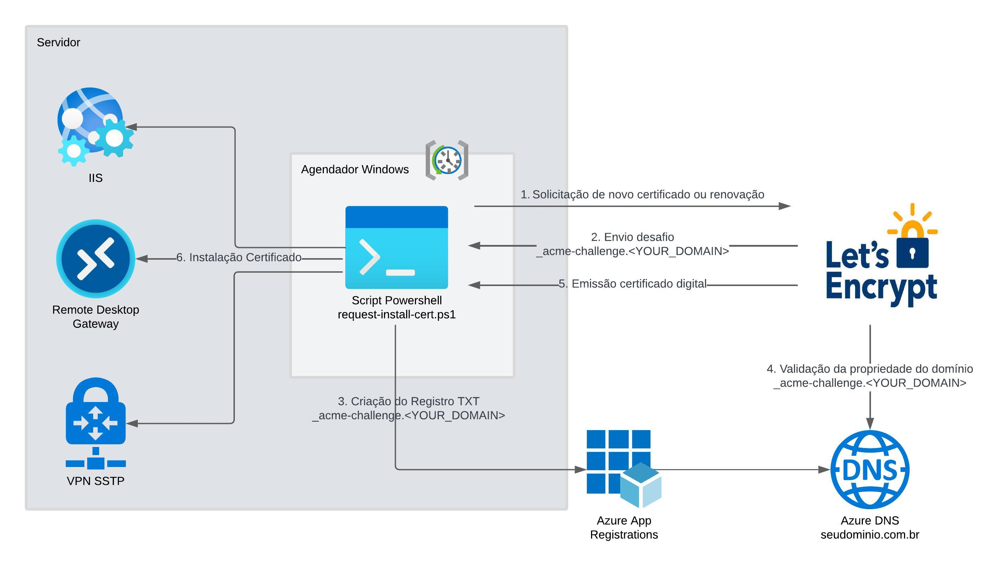

# Automação de emissão e instalação de certificados digitais Windows Server (IIS, RDGW, VPN-SSTP)

Este projeto fornece um script PowerShell para automatizar a emissão, instalação de certificados SSL(Let's Encrypt) usando o módulo Posh-ACME, Let’s Encrypt e o agendamento de tarefas no Windows para renovação automática. O script é capaz de criar o agendamento, emitir o certificado digital e configurar certificados em várias aplicações, incluindo IIS, RDGW e VPN-SSTP, ele é integrado com o Azure DNS para gerenciamento do desafio do Let-s Encrypt.  



## Funcionalidades ##  

**- Download e configuração:** O script realiza o download dos arquivos necessários para emissão, instalação e renovação dos certificados e configura as váriaveis necessárias para comunicação com Azure DNS.

**- Verificação e Instalação de Módulos:** O script verifica se os módulos necessários (Posh-ACME e Posh-ACME.Deploy) estão instalados e os instala se necessário.    

**- Configuração de Certificados:**  Automatiza a configuração de certificados SSL em IIS, RDGW e VPN-SSTP.

**- Integração com Azure:** Utiliza credenciais do Azure para autenticação e criação do registro TXT `_acme-challenge.seudominio.com` na Zona de DNS para comprovação de propriedade do domínio e geração do certificado.

**- Renovação Automática:** Verifica se um certificado já existe e, se necessário, renova o certificado existente e o instala.
> [!IMPORTANT]
> A renovação automática é realizada por meio do agendamento semanal criado no momento de instalação , no entanto, a renovação se dará após 60 dias da emissão ou renovação. 

**- Registro de Logs:** Redireciona a saída verbose para um arquivo de log para facilitar a auditoria e o diagnóstico, `c:\auto-renew-cert\posh-acme.log`.

## Parâmetros ##  
- `$Domain` (Obrigatório): Nome do domínio para o qual o certificado será solicitado.  
- `$Email` (Obrigatório): Email de contato para a solicitação do certificado.
> [!IMPORTANT]
> Let’s Encrypt envia lembretes quando o certificado está prestes a expirar, ajudando a garantir que você renove a tempo e mantenha seu site seguro ou Se houver algum problema com o certificado, como falhas na renovação automática, você será notificado.
- **InstallType**: O tipo de instalação:
  - `$I` (Opcional): Configurar certificado no IIS.  
  - `$R` (Opcional): Configurar certificado no RDGW.  
  - `$V` (Opcional): Configurar certificado no VPN-SSTP.  
- `dayOfWeek`(Obrigatório) O dia da semana para a execução da tarefa agendada.
- `time` (Obrigatório): A hora de execução da tarefa agendada (formato HH:MM AM/PM).
- `AZSubscriptionID` (Obrigatório): O ID da assinatura do Azure.
- `Client_ID` (Obrigatório): O ID do cliente (Client ID) do Azure.
- `Client_Secret` (Obrigatório): O segredo do cliente (Client Secret) do Azure.
- `Tenant_ID` (Obrigatório): O ID do locatário (Tenant ID) do Azure.

## Uso ##


1. Abra o PowerShell com permissões de administrador.
2. O Script está publicado dentro do PowerShell Gallery realize a instalação utilizando o comando:
```powershell
Install-Script -Name Install-AutoRenewCertificate	
````
3. Permite a execução de script não assinados
```powershell
Set-ExecutionPolicy -ExecutionPolicy Unrestricted
````
4. Caso ainda não tenha dados de acesso do Azure DNS, configure o App Registration e a Role no [Azure](APP_REGISTRATION.md)
5. Execute o script fornecendo os parâmetros necessários:

```powershell
.\Install-AutoRenewCertificate.ps1
````  

## Requisitos ##
- PowerShell 5.1 ou superior.  
- Módulos Posh-ACME e Posh-ACME.Deploy.  
- Conta no Azure com permissões adequadas para gerenciar Zona de DNS. [Clique aqui](APP_REGISTRATION.md) para ver o procedimento de configuração
    - Por questões de segurança é extremamente importante criar uma role no Azure e conceder apenas as permissões necessárias no Resource Group que hospeada as zonas de DNS:  
      - Get DNS Zone   
      - Get record set of type TXT   
      - Create or update record set of type TXT  

https://learn.microsoft.com/pt-br/entra/identity-platform/quickstart-register-app?tabs=certificate
  
### O que é Posh-ACME? ### 
Posh-ACME é um módulo PowerShell e cliente ACME que permite criar certificados SSL/TLS publicamente confiáveis a partir de uma autoridade certificadora compatível com ACME, como o Let’s Encrypt. Ele suporta certificados multi-domínio, wildcard, IP address, e certificados pré-criados, além de vários plugins de validação e formatos de saída.

### O que é Let’s Encrypt? ### 
Let’s Encrypt é uma autoridade certificadora gratuita, automatizada e aberta, que fornece certificados SSL/TLS para milhões de sites. É operada pela organização sem fins lucrativos Internet Security Research Group (ISRG) e visa tornar a web mais segura e privativa.

### Contribuição ###  
Contribuições são bem-vindas! Sinta-se à vontade para abrir issues e pull requests para melhorias e correções.

## Documentação  

- [Registro de Aplicativo e Criação de Role](APP_REGISTRATION.md)
